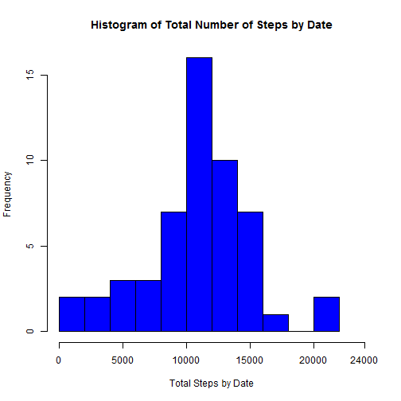
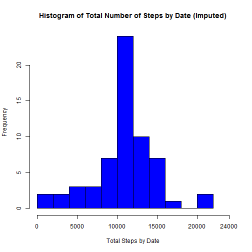
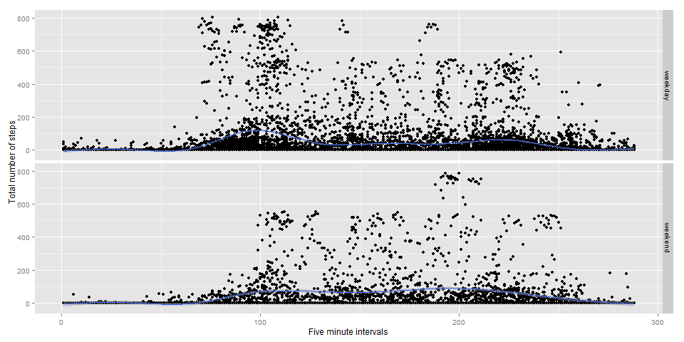

This is the first assignment of the Reproducible Research course. 

The assignment is to use personal activity monitoring data from devices such as Fitbit, Nike Fuelband, BodyMedia to compute and plot some basic statistics. The objective of the assignment is to illustrate how one should adopt literate programming standards to embed explanations of the data, analysis, code, and figures. 


## Loading and Preprocessing the Data


The dataset is stored in a comma-separated-value (CSV) file and there are a total of 17,568 observations in this dataset. 


```r
summary(data)
```

```
##      steps                date          interval     
##  Min.   :  0.00   2012-10-01:  288   Min.   :   0.0  
##  1st Qu.:  0.00   2012-10-02:  288   1st Qu.: 588.8  
##  Median :  0.00   2012-10-03:  288   Median :1177.5  
##  Mean   : 37.38   2012-10-04:  288   Mean   :1177.5  
##  3rd Qu.: 12.00   2012-10-05:  288   3rd Qu.:1766.2  
##  Max.   :806.00   2012-10-06:  288   Max.   :2355.0  
##  NA's   :2304     (Other)   :15840
```

The variables included in this dataset are:

1. steps: Number of steps taking in a 5-minute interval (missing values are coded as NA)

2. date: The date on which the measurement was taken in YYYY-MM-DD format

3. interval: Identifier for the 5-minute interval in which measurement was taken


```r
head(data)
```

```
##   steps       date interval
## 1    NA 2012-10-01        0
## 2    NA 2012-10-01        5
## 3    NA 2012-10-01       10
## 4    NA 2012-10-01       15
## 5    NA 2012-10-01       20
## 6    NA 2012-10-01       25
```


The data consists of observations for 61 days. The dates run from 2012-10-01 to 2012-11-30. Each day split into 5 minute intervals starting with interval 0 and ending with interval 2355. This essentially is data starting from 00:00 hrs and ending with 23:55 hrs or one full 24 hour cycle split into 5 minute intervals. 

The discontinuous nature of the **interval** (e.g., jump from 00:55 or 55 seconds to 1:00 or 100) variable will cause breaks in the plot if we try to plot one of the axis as the interval. So we 'clean up' the data by adding a new column called **intervalNum* that basically provides a sequential number from 1 till 288 indicating the 288 five minute slots in a day. 


So now our cleaned up or enhanced version of the data looks like this. 

```r
head(data)
```

```
##   steps       date interval intervalNum
## 1    NA 2012-10-01        0           1
## 2    NA 2012-10-01        5           2
## 3    NA 2012-10-01       10           3
## 4    NA 2012-10-01       15           4
## 5    NA 2012-10-01       20           5
## 6    NA 2012-10-01       25           6
```


## What is the mean total number of steps taken by day

### Make a histogram of total number of steps taken each day

To create the histogram of total number of steps taken each day, we have to group the rows by each date and then add the steps across all 5 minute intervals. We do this by using **tapply**. The **hist** function can then be used to draw the frequency distribution of total steps by each date. 


```r
TotalStepsByDate <- tapply(data$steps, data$date, sum)
hist(TotalStepsByDate, 
     breaks = 10, 
     col = "blue1",
     xlim = c(0,24000),
     xaxt = "n",
     main = "Histogram of Total Number of Steps by Date", 
     xlab = "Total Steps by Date")
axis(side = 1, at=c(0,5000,10000,15000,20000,24000))
```

 


### Calculate and report the **mean** and **median** total number of steps taken each day

The **mean** of the total steps taken is computed by averaging each of the dates from **TotalStepsByDate** but making sure that we remove any NA entries. 


```r
mean(TotalStepsByDate, na.rm=TRUE)
```

```
## [1] 10766.19
```

The **median** is computed in a similar fashion - the median is the median of the vector **TotalStepsByDate** but making sure that we remove any NA entries. 


```r
median(TotalStepsByDate, na.rm=TRUE)
```

```
## [1] 10765
```

## What is the average daily activity pattern

### Make a time series plot of the 5 minute interval (x-axis) and the average number of steps taken, averaged across all day

To create the time series plot, we have to group the rows by each 5 minute interval and then average the steps across all 5 minute intervals. We do this by using **tapply**. The **barplot** function can then be used to plot the average number of steps taken for all days across that time interval. 


```r
MeanStepsByInterval <- tapply(data$steps, data$interval, mean, na.rm=TRUE)
barplot(MeanStepsByInterval,
        col = "blue1",
        main = "Average Number of Steps by 5 minute intervals")
```

 

```r
png(filename="plot1.png", width=960, height=480)
```

### Which 5-minute interval, on average across all days in the datasets, contains the maximum number of steps
We get the maximum number of steps in a specific 5-minute interval by using the following function. The maximum steps is recorded at 08:35 across all days in the dataset.


```r
which.max(MeanStepsByInterval)
```

```
## 835 
## 104
```


## Imputing Missing Values

### Calculate and report the total number of missing values in the dataset

The following function can be used to check number of NA entries and then add them. 


```r
sum(is.na(data))
```

```
## [1] 2304
```

### Devise a strategy for filling in all of the missing values in the dataset

All of the missing values are in the column for *steps*. This may be either due to faulty sensors or lack of measurement data. We have four relatively straightforward options to impute the missing values

1. Use the *Mean* steps on a given day to impute the missing value. Sometimes when the entire day has NAs this method will not work. Under these cases we can take the average across all days to impute that value. 

2. Sames as (1) above but use the *Median* instead of the *Mean* to impute the value

3. Use the *Mean* steps at a given 5 minute interval to impute any missing values for that particular 5 minute interval anywhere in the dataset. We will use this method in the subsequent code. 

4. Same as (3) above but use the *Median* instead of the *Mean* to impute the value

### Create a new dataset that is equal to the original dataset but with the missing data filled in

We implement (3) above by looping through all the rows and if the value of the **steps** variable is NA then we use the *mean* for that interval from our **MeanStepsByInterval** list to create a new variable called the **imputedSteps**. Note that we still keep the original variable but add a new column for this purpose. Alternatively, we coud have used the same **steps** variable to impute the NA data. 


```r
for (i in 1:nrow(data)) {
        data[i,5] <- ifelse(is.na(data[i,1]), 
                            MeanStepsByInterval[[data[i,4]]][1], 
                            data[i,1])
}
colnames(data)[5] <- "imputedSteps"
head(data)
```

```
##   steps       date interval intervalNum imputedSteps
## 1    NA 2012-10-01        0           1    1.7169811
## 2    NA 2012-10-01        5           2    0.3396226
## 3    NA 2012-10-01       10           3    0.1320755
## 4    NA 2012-10-01       15           4    0.1509434
## 5    NA 2012-10-01       20           5    0.0754717
## 6    NA 2012-10-01       25           6    2.0943396
```

## Make a histogram of the total number of steps taken each day and calculate the mean and median total number of steps taken per day

Like before to create the histogram of total number of steps taken each day, we group the rows by each date and then add the steps across all 5 minute intervals. However, we now use the new column imputedSteps to compute the total steps. We then compute the **mean** and **median** of this. Two key observations can be made. 

1. With the NA values imputed using the average for that interval we get the same mean and median values. 

2. Also this value is closer to the median from the previous case (i.e., computed using NAs)

The total daily number of steps is the same in both cases which is


```r
TotalImputedStepsByDate <- tapply(data$imputedSteps, data$date, sum)
hist(TotalImputedStepsByDate, 
     breaks = 10, 
     col = "blue1",
     xlim = c(0,24000),
     xaxt = "n",
     main = "Histogram of Total Number of Steps by Date with NA values imputed by the Mean", 
     xlab = "Total Steps by Date")
axis(side = 1, at=c(0,5000,10000,15000,20000,24000))
```

 

```r
iMean <- mean(TotalImputedStepsByDate, na.rm=TRUE)
iMean
```

```
## [1] 10766.19
```

```r
median(TotalImputedStepsByDate, na.rm=TRUE)
```

```
## [1] 10766.19
```

The total daily number of steps is the same in both cases which is 1.0766189 &times; 10<sup>4</sup>.

## Are there differences in Activity patterns between weekdays and weekends

### Create a new factor variable in the dataset with two levels - "weekday" and "weekend" indicating whether a given date is a weekday or weekend day

We use the **isWeekday** function from *timeDate* library to check if a date is a weekday or a weekend. We then create a new column called **daytype** that records this fact. The first few elements of our dataset shows the addition of this new column. 


```r
library(timeDate)
```

```
## Warning: package 'timeDate' was built under R version 3.1.2
```

```r
for (i in 1:nrow(data)) {
        data[i,6] <- ifelse(isWeekday(data[i,2], wday = 1:5), "weekday", "weekend")
}
colnames(data)[6] <- "daytype"
head(data)
```

```
##   steps       date interval intervalNum imputedSteps daytype
## 1    NA 2012-10-01        0           1    1.7169811 weekday
## 2    NA 2012-10-01        5           2    0.3396226 weekday
## 3    NA 2012-10-01       10           3    0.1320755 weekday
## 4    NA 2012-10-01       15           4    0.1509434 weekday
## 5    NA 2012-10-01       20           5    0.0754717 weekday
## 6    NA 2012-10-01       25           6    2.0943396 weekday
```

### Make a panel plot containing a time series plot (i.e. type = "l") of the 5-minute interval (x-axis) and the average number of steps taken, averaged across all weekday days or weekend days (y-axis). 

We use the **ggplot2** package to create a **qplot** with the interval numbers as the x-axis and the imputed steps as the y-axis. Also we use the facets to draw two frames one for *weekday" and the other for "weeken". The smooth line drawn over the points clearly shows how the weekday peak usually occurs in the earlier time intervals, while for the weekend the peak is activity is more evenly distributed but with more activity in the afternoon intervals. See Figure 1 for the plot. 


```r
library(ggplot2)
png(filename="figure1.png", width=960, height=480)

qplot(intervalNum, imputedSteps,
        data = data, 
        type = "1",
        facets = daytype ~ .,
        group = 1,
        geom = c("point","smooth"),
        geom_line(linetype="solid"),
        xlab = "Five minute intervals",
        ylab = "Total number of steps")
dev.off()
```

 

```
## RStudioGD 
##         2
```

